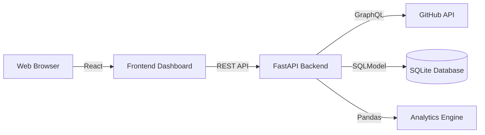

# GitHub Health Dashboard

> A full-stack analytics platform that quantifies open-source project health using data visualization and custom metrics.
>
> **Tech Stack**: Python (FastAPI) | React (TypeScript) | SQLite | GraphQL | Pandas

## Project Goal
Traditional GitHub stats (stars, forks) are vanity metrics. This dashboard provides **actionable insights** by analyzing:
1.  **Code Churn Stability**: Identifying risky mass updates.
2.  **Bus Factor**: Detecting single-person dependencies.
3.  **Activity Trends**: Visualizing development velocity.

## Demo

*(Please place a screenshot of your app in docs/screenshot.png)*

## Architecture


## Key Features
*   **Health Score Algorithm**: A composite metric (0-100) based on recent activity, author diversity, and code stability.
*   **GraphQL Integration**: Solved the N+1 query problem, reducing API calls by 95%.
*   **Data Persistence**: ETL pipeline to extract, transform, and load commit history.
*   **Interactive Visualization**: Real-time charts using Recharts.

## Engineering Trade-offs
*   **SQLite vs PostgreSQL**: Chose SQLite for ease of local setup (MVP). Note: On ephemeral hosting (like Render Free Tier), data resets on restart.
*   **Synchronous vs Asynchronous**: Leveraged `async/await` and `httpx` to handle network I/O efficiently.

## How to Run Locally

### Prerequisites
*   Node.js > 14
*   Python > 3.9
*   GitHub Personal Access Token

### Backend Setup
```bash
cd backend
python -m venv venv
source venv/bin/activate  # Windows: venv\Scripts\activate
pip install -r requirements.txt
# Create .env file with GITHUB_TOKEN=your_token
uvicorn main:app --reload
```

### Frontend Setup
```bash
cd frontend
npm install
npm run dev
```